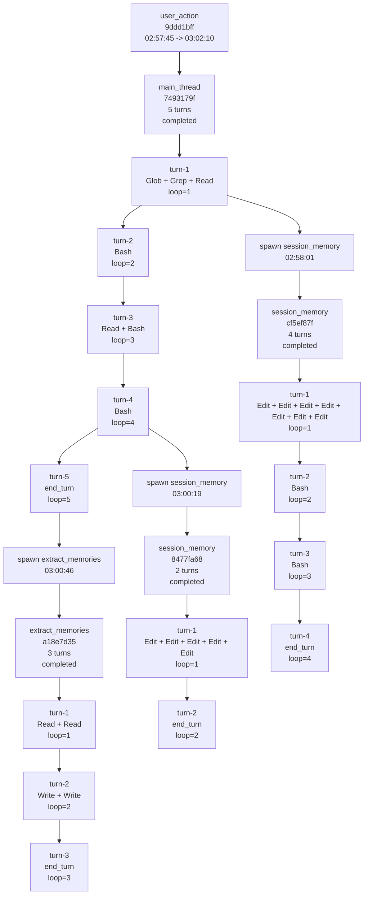

# Action Report

This report is generated directly from the current .observability files and DuckDB facts. Copy the Mermaid block into Mermaid Live Editor to visualize the graph.

## Basics

- user_action_id: 9ddd1bff-65b6-414f-bf04-418809eb6ff7
- UTC: 2026-04-22T18:57:45.421Z -> 2026-04-22T19:02:10.156Z
- Local: 2026-04-23 02:57:45 -> 2026-04-23 03:02:10
- duration_ms: 264735
- query_count: 4
- subagent_count: 3
- tool_call_count: 25
- total_prompt_input_tokens: 1221782
- total_billed_tokens: 1233637

## Summary

This action expanded into 4 queries and 3 subagents.

## Mermaid DAG

## Query List

### main_thread 7493179f-d7ba-4302-bdf5-281cbc86aa9c

- query_source: repl_main_thread
- subagent_reason: repl_main_thread
- time: 2026-04-23 02:57:45 -> 2026-04-23 03:00:46
- turn_count: 5
- max_loop_iter: 5.0
- tool_call_count: 7
- terminal_reason: completed
- completeness: strict=true, inferred=true

- turn-1: tools=Glob + Grep + Read, stop_reason=tool_use, transition_out=next_turn, duration_ms=18769, strict_closed=true
- turn-2: tools=Bash, stop_reason=tool_use, transition_out=next_turn, duration_ms=92324, strict_closed=true
- turn-3: tools=Read + Bash, stop_reason=tool_use, transition_out=next_turn, duration_ms=21222, strict_closed=true
- turn-4: tools=Bash, stop_reason=tool_use, transition_out=next_turn, duration_ms=34112, strict_closed=true
- turn-5: tools=none, stop_reason=end_turn, transition_out=, duration_ms=14503, strict_closed=true

### session_memory cf5ef87f-e227-4f65-8c28-035da80e85e8

- query_source: session_memory
- subagent_reason: session_memory
- time: 2026-04-23 02:58:01 -> 2026-04-23 02:59:59
- turn_count: 4
- max_loop_iter: 4.0
- tool_call_count: 9
- terminal_reason: completed
- completeness: strict=true, inferred=true

- turn-1: tools=Edit + Edit + Edit + Edit + Edit + Edit + Edit, stop_reason=tool_use, transition_out=next_turn, duration_ms=68370, strict_closed=true
- turn-2: tools=Bash, stop_reason=tool_use, transition_out=next_turn, duration_ms=16677, strict_closed=true
- turn-3: tools=Bash, stop_reason=tool_use, transition_out=next_turn, duration_ms=24937, strict_closed=true
- turn-4: tools=none, stop_reason=end_turn, transition_out=, duration_ms=8046, strict_closed=true

### session_memory 8477fa68-0c8d-49de-a6db-22274577b1b2

- query_source: session_memory
- subagent_reason: session_memory
- time: 2026-04-23 03:00:19 -> 2026-04-23 03:02:00
- turn_count: 2
- max_loop_iter: 2.0
- tool_call_count: 5
- terminal_reason: completed
- completeness: strict=true, inferred=true

- turn-1: tools=Edit + Edit + Edit + Edit + Edit, stop_reason=tool_use, transition_out=next_turn, duration_ms=59493, strict_closed=true
- turn-2: tools=none, stop_reason=end_turn, transition_out=, duration_ms=41634, strict_closed=true

### extract_memories a18e7d35-8d66-4c2c-af96-3b9bf36d1f51

- query_source: extract_memories
- subagent_reason: extract_memories
- time: 2026-04-23 03:00:46 -> 2026-04-23 03:02:10
- turn_count: 3
- max_loop_iter: 3.0
- tool_call_count: 4
- terminal_reason: completed
- completeness: strict=true, inferred=true

- turn-1: tools=Read + Read, stop_reason=tool_use, transition_out=next_turn, duration_ms=22639, strict_closed=true
- turn-2: tools=Write + Write, stop_reason=tool_use, transition_out=next_turn, duration_ms=55224, strict_closed=true
- turn-3: tools=none, stop_reason=end_turn, transition_out=, duration_ms=5927, strict_closed=true

## Branch Points

- 2026-04-23 02:58:01: spawn session_memory, child_query=cf5ef87f-e227-4f65-8c28-035da80e85e8, attached after main-thread turn-1 by time inference
- 2026-04-23 03:00:19: spawn session_memory, child_query=8477fa68-0c8d-49de-a6db-22274577b1b2, attached after main-thread turn-4 by time inference
- 2026-04-23 03:00:46: spawn extract_memories, child_query=a18e7d35-8d66-4c2c-af96-3b9bf36d1f51, attached after main-thread turn-5 by time inference

## Reading SOP

1. Find the target action in user_actions.
2. Use queries to list all agents and branches under that action.
3. Use turns to inspect loop count and turn termination.
4. Use tools to inspect concrete tool calls per turn.
5. Use events_raw for key events only: query.started, api.stream.completed, subagent.spawned, query.terminated.
6. If you need content, follow snapshot refs into .observability/snapshots.

