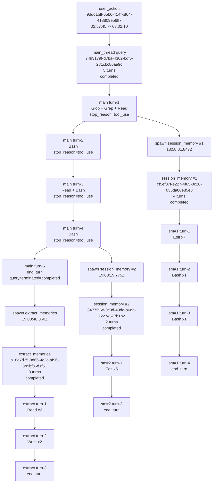

# User Action 流程解析

本报告严格依据当前 `.observability/events-20260422.jsonl` 与 DuckDB 中对应记录生成。  
注意：事件文件名按 `UTC` 日期命名，因此北京时间 `2026-04-23 02:57:45` 到 `03:02:10` 的这次动作，落在 `events-20260422.jsonl` 中是正常现象。

## 基本信息

- `user_action_id`: `9ddd1bff-65b6-414f-bf04-418809eb6ff7`
- 时间范围:
  - `UTC`: `2026-04-22T18:57:45.421Z` -> `2026-04-22T19:02:10.156Z`
  - `Asia/Shanghai`: `2026-04-23 02:57:45` -> `2026-04-23 03:02:10`
- 总时长: `264735 ms`
- 该次动作展开结果:
  - `1` 条主线程 query
  - `2` 条 `session_memory` 子链路 query
  - `1` 条 `extract_memories` 子链路 query
  - `25` 次工具调用

## 一句话总结

你表面上只发起了一次用户动作，但系统内部把它展开成了 `4` 条 query。  
主线程一共跑了 `5` 个 turn，在推进过程中分叉出了 `2` 条 `session_memory`，主线程完成后又分叉出 `1` 条 `extract_memories`。  
因此这次不是单链条，而是一棵带并发子链路的 DAG。

## Mermaid DAG

下面这段可以直接复制到 Mermaid Live Editor 或支持 Mermaid 的网站查看。

## 自然语言流程解释

### 1. 主线程启动

- `18:57:45.443Z`
  - 主线程 `query.started`
  - `query_id = 7493179f-d7ba-4302-bdf5-281cbc86aa9c`
- `18:57:45.453Z`
  - 主线程 `turn-1` 开始

这说明这次用户动作先进入主线程 query。

### 2. 主线程 turn-1 先做探索

在 `turn-1` 中，assistant 决定调用了三种工具：

- `18:58:00.990Z` `Glob`
- `18:58:01.474Z` `Grep`
- `18:58:01.521Z` `Read`

随后：

- `18:58:01.825Z`
  - `api.stream.completed`
  - `stop_reason = tool_use`

这表示第一轮不是直接回答完成，而是先产生了一批工具调用。

### 3. 第一处分支：启动 session_memory #1

紧接着主线程第一轮工具之后：

- `18:58:01.847Z`
  - `subagent.spawned`
  - `subagent_reason = session_memory`
  - `subagent_id = a00ed066c632706a7`
- `18:58:01.862Z`
  - 该 subagent 自己的 `query.started`
  - `query_id = cf5ef87f-e227-4f65-8c28-035da80e85e8`

这就是第一个明显分支点。  
主线程没有停下来，而是继续跑；同时后台起了一条 `session_memory` 子链路。

### 4. 主线程继续推进 turn-2 / turn-3 / turn-4

主线程接着继续：

- `turn-2`
  - 检测到 `Bash`
  - `18:58:17.271Z` `api.stream.completed`
  - `stop_reason = tool_use`

- `turn-3`
  - 检测到 `Read + Bash`
  - `18:59:57.288Z` `api.stream.completed`
  - `stop_reason = tool_use`

- `turn-4`
  - 检测到 `Bash`
  - `19:00:19.646Z` `api.stream.completed`
  - `stop_reason = tool_use`

也就是说，主线程本质上是一个多轮 agentic loop：

- 前四轮都先决定继续用工具
- 没有在前四轮直接结束

### 5. 第一条 session_memory 在后台跑了 4 轮

`session_memory #1` 的 query 是：

- `query_id = cf5ef87f-e227-4f65-8c28-035da80e85e8`
- 时间：`18:58:01.862Z -> 18:59:59.894Z`
- 共 `4` 个 turn

它的主要动作是：

- `turn-1`: `Edit x7`
- `turn-2`: `Bash x1`
- `turn-3`: `Bash x1`
- `turn-4`: `end_turn`
- 最终：`query.terminated = completed`

这说明第一条 `session_memory` 是一个比较重的后台修改链路。

### 6. 第二处分支：再次启动 session_memory #2

在主线程 `turn-4` 结束后：

- `19:00:19.775Z`
  - 第二次 `subagent.spawned(session_memory)`
- `19:00:19.794Z`
  - 第二条 `session_memory` 自己的 `query.started`
  - `query_id = 8477fa68-0c8d-49de-a6db-22274577b1b2`

所以这次用户动作里，`session_memory` 并不是只跑一次，而是跑了两次。

### 7. 第二条 session_memory 更短

第二条 `session_memory`：

- `query_id = 8477fa68-0c8d-49de-a6db-22274577b1b2`
- 时间：`19:00:19.794Z -> 19:02:00.961Z`
- 共 `2` 个 turn

主要动作：

- `turn-1`: `Edit x5`
- `turn-2`: `end_turn`
- 最终：`query.terminated = completed`

它比第一条更短，更像一次快速的记忆更新。

### 8. 主线程最终在 turn-5 完成

主线程最后一轮：

- `19:00:31.884Z`
  - 进入 `turn-5`
- `19:00:46.343Z`
  - `api.stream.completed`
  - `stop_reason = end_turn`
- `19:00:46.365Z`
  - `query.terminated`
  - `reason = completed`

因此主线程自己的轨迹可以概括为：

- `turn-1`: 工具
- `turn-2`: 工具
- `turn-3`: 工具
- `turn-4`: 工具
- `turn-5`: 最终结束

### 9. 第三处分支：主线程结束后启动 extract_memories

主线程刚结束：

- `19:00:46.360Z`
  - `subagent.spawned(extract_memories)`
- `19:00:46.366Z`
  - `extract_memories query.started`
  - `query_id = a18e7d35-8d66-4c2c-af96-3b9bf36d1f51`

这说明 `extract_memories` 是一个尾处理分支，不是在主线程早期并发拉起的。

### 10. extract_memories 走了 3 轮：先读后写

`extract_memories`：

- 时间：`19:00:46.366Z -> 19:02:10.156Z`
- 共 `3` 个 turn

主要动作：

- `turn-1`: `Read x2`
- `turn-2`: `Write x2`
- `turn-3`: `end_turn`
- 最终：`query.terminated = completed`

所以这条链路很清楚：

1. 先读
2. 再写
3. 然后结束

## 这次动作的关键分支节点

这次日志里一共能明确看到 `3` 个分支节点：

1. `18:58:01.847Z`
   - 主线程 `turn-1` 工具轮结束后
   - 分出 `session_memory #1`

2. `19:00:19.775Z`
   - 主线程 `turn-4` 工具轮结束后
   - 分出 `session_memory #2`

3. `19:00:46.360Z`
   - 主线程 query 完成后
   - 分出 `extract_memories`

## 严格按现有日志可以得出的结论

### 可以确认的

- 这是 `1` 次用户动作，不是多次
- 这 `1` 次用户动作内部展开成了 `4` 条 query
- 主线程跑了 `5` 个 turn
- 两条 `session_memory` 一共跑了 `6` 个 turn
- 一条 `extract_memories` 跑了 `3` 个 turn
- 所有 query 最终都 `completed`
- 所有工具调用最终都闭合

### 不能从现有日志直接确认的

- 为什么系统“此刻决定”要拉起某条 `session_memory`
- assistant 文本里到底说了什么完整内容
- 每一次 `Edit/Write` 具体改了什么正文

这些内容需要继续看对应的 snapshot，如：

- `request.json`
- `response.json`
- `state.snapshot.before_turn.json`
- `state.snapshot.after_turn.json`

## 适合你以后复用的读法

如果以后你还想按这个格式读某次动作，顺序就是：

1. 先拿 `user_action_id`
2. 列出该 action 下所有 `query`
3. 列出所有 `subagent`
4. 拉时间线，只保留关键节点：
   - `query.started`
   - `turn.started`
   - `assistant.tool_use.detected`
   - `api.stream.completed`
   - `subagent.spawned`
   - `state.transitioned`
   - `query.terminated`
   - `subagent.completed`
5. 再根据需要去看 snapshot 正文

