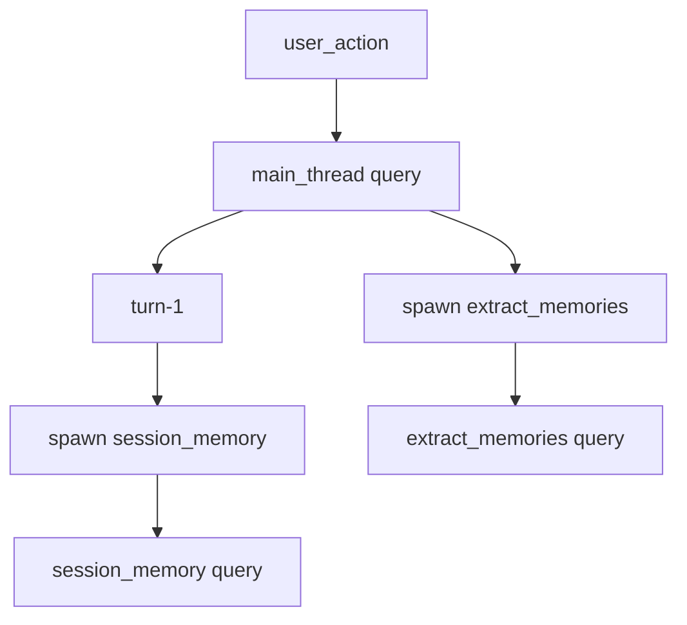

# Claude Code Best V5 (CCB)

[](https://github.com/claude-code-best/claude-code/stargazers)
[](https://github.com/claude-code-best/claude-code/graphs/contributors)
[](https://github.com/claude-code-best/claude-code/issues)
[](https://github.com/claude-code-best/claude-code/blob/main/LICENSE)
[](https://github.com/claude-code-best/claude-code/commits/main)
[](https://bun.sh/)
[](https://discord.gg/qZU6zS7Q)

> Which Claude do you like? The open source one is the best.

牢 A (Anthropic) 官方 [Claude Code](https://docs.anthropic.com/en/docs/claude-code) CLI 工具的源码反编译/逆向还原项目。目标是将 Claude Code 大部分功能及工程化能力复现 (问就是老佛爷已经付过钱了)。虽然很难绷, 但是它叫做 CCB(踩踩背)... 而且, 我们实现了企业版或者需要登陆 Claude 账号才能使用的特性, 实现技术普惠

[文档在这里, 支持投稿 PR](https://ccb.agent-aura.top/) | [留影文档在这里](./Friends.md) | [Discord 群组](https://discord.gg/qZU6zS7Q)

| 特性 | 说明 | 文档 |
|------|------|------|
| **Claude 群控技术** | Pipe IPC 多实例协作：同机 main/sub 自动编排 + LAN 跨机器零配置发现与通讯，`/pipes` 选择面板 + `Shift+↓` 交互 + 消息广播路由 | [Pipe IPC](https://ccb.agent-aura.top/docs/features/pipes-and-lan) / [LAN](https://ccb.agent-aura.top/docs/features/lan-pipes) |
| **ACP 协议一等一支持** | 支持接入 Zed、Cursor 等 IDE，支持会话恢复、Skills、权限桥接 | [文档](https://ccb.agent-aura.top/docs/features/acp-zed) |
| **Remote Control 私有部署** | Docker 自托管远程界面, 可以手机上看 CC | [文档](https://ccb.agent-aura.top/docs/features/remote-control-self-hosting) |
| **Langfuse 监控** | 企业级 Agent 监控, 可以清晰看到每次 agent loop 细节, 可以一键转化为数据集 | [文档](https://ccb.agent-aura.top/docs/features/langfuse-monitoring) |
| **Web Search** | 内置网页搜索工具, 支持 bing 和 brave 搜索 | [文档](https://ccb.agent-aura.top/docs/features/web-browser-tool) |
| **Poor Mode** | 穷鬼模式，关闭记忆提取和键入建议,大幅度减少并发请求 | /poor 可以开关 |
| **自定义模型供应商** | OpenAI/Anthropic/Gemini/Grok 兼容 | [文档](https://ccb.agent-aura.top/docs/features/custom-platform-login) |
| Voice Mode | Push-to-Talk 语音输入 | [文档](https://ccb.agent-aura.top/docs/features/voice-mode) |
| Computer Use | 屏幕截图、键鼠控制 | [文档](https://ccb.agent-aura.top/docs/features/computer-use) |
| Chrome Use | 浏览器自动化、表单填写、数据抓取 | [自托管](https://ccb.agent-aura.top/docs/features/chrome-use-mcp) [原生版](https://ccb.agent-aura.top/docs/features/claude-in-chrome-mcp) |
| Sentry | 企业级错误追踪 | [文档](https://ccb.agent-aura.top/docs/internals/sentry-setup) |
| GrowthBook | 企业级特性开关 | [文档](https://ccb.agent-aura.top/docs/internals/growthbook-adapter) |
| /dream 记忆整理 | 自动整理和优化记忆文件 | [文档](https://ccb.agent-aura.top/docs/features/auto-dream) |

- 🚀 [想要启动项目](#快速开始源码版)
- 🐛 [想要调试项目](#vs-code-调试)
- 📖 [想要学习项目](#teach-me-学习项目)


## ⚡ 快速开始(安装版)

不用克隆仓库, 从 NPM 下载后, 直接使用

```sh
bun  i -g claude-code-best
bun pm -g trust claude-code-best
ccb # 以 nodejs 打开 claude code
ccb-bun # 以 bun 形态打开
CLAUDE_BRIDGE_BASE_URL=https://remote-control.claude-code-best.win/ CLAUDE_BRIDGE_OAUTH_TOKEN=test-my-key ccb --remote-control # 我们有自部署的远程控制
```

## ⚡ 快速开始(源码版)

### ⚙️ 环境要求

一定要最新版本的 bun 啊, 不然一堆奇奇怪怪的 BUG!!! bun upgrade!!!

- 📦 [Bun](https://bun.sh/) >= 1.3.11
- ⚙️ 常规的配置 CC 的方式, 各大提供商都有自己的配置方式

### 📥 安装

```bash
bun install
```

### ▶️ 运行

```bash
# 开发模式, 看到版本号 888 说明就是对了
bun run dev

# 构建
bun run build
```

构建采用 code splitting 多文件打包（`build.ts`），产物输出到 `dist/` 目录（入口 `dist/cli.js` + 约 450 个 chunk 文件）。

构建出的版本 bun 和 node 都可以启动, 你 publish 到私有源可以直接启动

如果遇到 bug 请直接提一个 issues, 我们优先解决

### 👤 新人配置 /login

首次运行后，在 REPL 中输入 `/login` 命令进入登录配置界面，选择 **Anthropic Compatible** 即可对接第三方 API 兼容服务（无需 Anthropic 官方账号）。
选择 OpenAI 和 Gemini 对应的栏目都是支持相应协议的

需要填写的字段：

| 📌 字段 | 📝 说明 | 💡 示例 |
|------|------|------|
| Base URL | API 服务地址 | `https://api.example.com/v1` |
| API Key | 认证密钥 | `sk-xxx` |
| Haiku Model | 快速模型 ID | `claude-haiku-4-5-20251001` |
| Sonnet Model | 均衡模型 ID | `claude-sonnet-4-6` |
| Opus Model | 高性能模型 ID | `claude-opus-4-6` |

- ⌨️ **Tab / Shift+Tab** 切换字段，**Enter** 确认并跳到下一个，最后一个字段按 Enter 保存


> ℹ️ 支持所有 Anthropic API 兼容服务（如 OpenRouter、AWS Bedrock 代理等），只要接口兼容 Messages API 即可。

## Feature Flags

所有功能开关通过 `FEATURE_<FLAG_NAME>=1` 环境变量启用，例如：

```bash
FEATURE_BUDDY=1 FEATURE_FORK_SUBAGENT=1 bun run dev
```

各 Feature 的详细说明见 [`docs/features/`](docs/features/) 目录，欢迎投稿补充。

## VS Code 调试

TUI (REPL) 模式需要真实终端，无法直接通过 VS Code launch 启动调试。使用 **attach 模式**：

### 步骤

1. **终端启动 inspect 服务**：
   ```bash
   bun run dev:inspect
   ```
   会输出类似 `ws://localhost:8888/xxxxxxxx` 的地址。

2. **VS Code 附着调试器**：
   - 在 `src/` 文件中打断点
   - F5 → 选择 **"Attach to Bun (TUI debug)"**


## Teach Me 学习项目

我们新加了一个 teach-me skills, 通过问答式引导帮你理解这个项目的任何模块。(调整 [sigma skill 而来](https://github.com/sanyuan0704/sanyuan-skills))

```bash
# 在 REPL 中直接输入
/teach-me Claude Code 架构
/teach-me React Ink 终端渲染 --level beginner
/teach-me Tool 系统 --resume
```

### 它能做什么

- **诊断水平** — 自动评估你对相关概念的掌握程度，跳过已知的、聚焦薄弱的
- **构建学习路径** — 将主题拆解为 5-15 个原子概念，按依赖排序逐步推进
- **苏格拉底式提问** — 用选项引导思考，而非直接给答案
- **错误概念追踪** — 发现并纠正深层误解
- **断点续学** — `--resume` 从上次进度继续

### 学习记录

学习进度保存在 `.claude/skills/teach-me/` 目录下，支持跨主题学习者档案。

## 相关文档及网站

- **在线文档（Mintlify）**: [ccb.agent-aura.top](https://ccb.agent-aura.top/) — 文档源码位于 [`docs/`](docs/) 目录，欢迎投稿 PR
- **DeepWiki**: <https://deepwiki.com/claude-code-best/claude-code>

## 本地可观测系统 V1（推荐运行方案）

当前仓库已经内置了一套本地优先的可观测系统 V1，目标不是“只看昨天的日报”，而是支持你在本机 `debug` 一次真实 query 后，立刻回看：

- 一次 `user_action` 展开成了哪些 `query / turn / tool / subagent`
- 主线程和子链路分别花了多少 token
- 当前链路完整性是否闭合
- 某个 subagent 为什么会在这一刻被拉起
- 如何把一次动作自动生成为 Mermaid flowchart

完整研究文档和版本化说明见：

- [ObservrityTask 总入口](./ObservrityTask/README.md)
- [V1 总览](./ObservrityTask/10-%E7%B3%BB%E7%BB%9F%E7%89%88%E6%9C%AC/v1/01-%E6%80%BB%E8%A7%88/%E5%BD%93%E5%89%8D%E5%8F%AF%E8%A7%82%E6%B5%8B%E7%B3%BB%E7%BB%9FV1%E6%B7%B1%E5%BA%A6%E7%A0%94%E7%A9%B6%E6%8A%A5%E5%91%8A.md)
- [QueryLoop 全流程详解](./ObservrityTask/10-%E7%B3%BB%E7%BB%9F%E7%89%88%E6%9C%AC/v1/04-%E4%B8%93%E9%A2%98%E7%A0%94%E7%A9%B6/QueryLoop%E5%85%A8%E6%B5%81%E7%A8%8B%E8%AF%A6%E8%A7%A3%EF%BC%88%E6%BA%90%E7%A0%81%E7%89%88%EF%BC%89.md)
- [Subagent 触发因果任务书](./ObservrityTask/10-%E7%B3%BB%E7%BB%9F%E7%89%88%E6%9C%AC/v1/04-%E4%B8%93%E9%A2%98%E7%A0%94%E7%A9%B6/Subagent%E8%A7%A6%E5%8F%91%E5%9B%A0%E6%9E%9C%E5%8F%AF%E8%A7%82%E6%B5%8B%E4%BB%BB%E5%8A%A1%E4%B9%A6.md)

### V1 当前能力

| 能力层 | 当前能力 |
|------|------|
| 事件层 | 主线程、turn、tool、subagent、recovery、snapshot 全链路落盘到 `.observability/events-YYYYMMDD.jsonl` |
| ID 层 | `user_action_id / query_id / turn_id / tool_call_id / subagent_id` 已可稳定串联 |
| 成本层 | 区分 `Raw Input / Cache Read / Cache Create / Total Prompt Input / Output / Total Billed` |
| 完整性层 | `query / turn / tool / subagent` 闭合率可统计，当前最新样本主链已闭合 |
| Agent 层 | 可按 `main_thread / session_memory / extract_memories / ...` 拆分成本与流程 |
| 因果层 | `subagent_reason + subagent_trigger_kind + subagent_trigger_detail` 已接入 |
| 阅读层 | 支持 `daily_summary`、`dashboard`、`read_timeline`、`explain_action` |
| 可视化层 | 支持自动生成 Mermaid DAG，直接复制到 Mermaid Live Editor 查看 |

### 推荐运行方案

以前更像“先跑程序，再回头看零散日志”。  
现在推荐直接按下面这套观测驱动流程运行：

1. 启动 debug 版本

```bash
bun run dev
```

2. 在 REPL 里真实发送一条 query

3. 重建本地观测库

```powershell
powershell -ExecutionPolicy Bypass -File E:\claude-code\scripts\observability\rebuild_observability_db.ps1
```

4. 直接生成最近一次动作的自动报告

```powershell
powershell -ExecutionPolicy Bypass -File E:\claude-code\scripts\observability\explain_action.ps1 -Latest
```

5. 如果要看日级总览或 dashboard

```powershell
powershell -ExecutionPolicy Bypass -File E:\claude-code\scripts\observability\daily_summary.ps1
powershell -ExecutionPolicy Bypass -File E:\claude-code\scripts\observability\build_dashboard.ps1
```

这套流程的目标是：**每做一次改动，就能用一条真实 `user_action` 做回放和验收。**

### 如何从一个 `user_action_id` 得到完整 flowchart

先查最近几个动作：

```powershell
E:\claude-code\tools\duckdb\duckdb.exe -json E:\claude-code\.observability\observability_v1.duckdb "select user_action_id, started_at, duration_ms, query_count, subagent_count, total_prompt_input_tokens, total_billed_tokens from user_actions order by started_at_ms desc limit 10;"
```

拿到目标 `user_action_id` 后，直接生成 Markdown + Mermaid：

```powershell
powershell -ExecutionPolicy Bypass -File E:\claude-code\scripts\observability\explain_action.ps1 -UserActionId 12330098-180b-4063-9f96-af47b7e7c39f
```

输出结果会在 `ObservrityTask/` 下生成一份报告，里面自带：

- Basics
- Query List
- Branch Points
- Mermaid DAG
- Reading SOP

Mermaid 结构大致会长成这样：



在最新 V1 里，分叉点不再只是“这里开了个 subagent”，而是会直接写出触发原因，例如：

- `post_sampling_hook / token_threshold_and_tool_threshold`
- `post_sampling_hook / token_threshold_and_natural_break`
- `stop_hook_background / post_turn_background_extraction`

### 典型阅读路径

如果你的目标是“看懂刚刚这次用户动作到底发生了什么”，推荐顺序：

1. `user_actions`：先找到目标 `user_action_id`
2. `queries`：看这次动作展开成几条主/子链路
3. `subagents`：看每条子链路为什么被拉起
4. `turns`：看每条 query 跑了几轮
5. `tools`：看每轮具体调用了什么工具
6. `events_raw + snapshots`：看细节和证据
7. `explain_action.ps1`：把以上内容收敛成一份可读报告

### 一次真实样本会看到什么

以一次最新样本为例，报告里已经可以直接看到：

- `session_memory`
  - `trigger_kind = post_sampling_hook`
  - `trigger_detail = token_threshold_and_tool_threshold`
- `extract_memories`
  - `trigger_kind = stop_hook_background`
  - `trigger_detail = post_turn_background_extraction`
- 第二次 `session_memory`
  - `trigger_kind = post_sampling_hook`
  - `trigger_detail = token_threshold_and_natural_break`

这意味着 V1 现在已经不只是“记录发生了什么”，而是开始具备回答：

**“为什么在这一刻分叉出这个子 agent”**

## Contributors

<a href="https://github.com/claude-code-best/claude-code/graphs/contributors">
  
</a>

## Star History

<a href="https://www.star-history.com/?repos=claude-code-best%2Fclaude-code&type=date&legend=top-left">
 <picture>
   <source media="(prefers-color-scheme: dark)" srcset="https://api.star-history.com/image?repos=claude-code-best/claude-code&type=date&theme=dark&legend=top-left" />
   <source media="(prefers-color-scheme: light)" srcset="https://api.star-history.com/image?repos=claude-code-best/claude-code&type=date&legend=top-left" />
   
 </picture>
</a>

## 许可证

本项目仅供学习研究用途。Claude Code 的所有权利归 [Anthropic](https://www.anthropic.com/) 所有。
