# CC 可观测系统

<p align="center">
  <strong>把 Claude Code 的一次动作，变成可回放、可评测、可改进的事实链。</strong>
</p>

<p align="center">
  <a href="https://github.com/claude-code-best/claude-code">
    
  </a>
  
  
  
  
</p>

> 本项目来自原始 CCB 项目：[claude-code-best/claude-code](https://github.com/claude-code-best/claude-code)。  
> 当前 README 聚焦本仓库在 **本地可观测、单 action 深度解析、实验评测、反馈闭环** 方向上的演进。

---

## 这是什么？

**CC 可观测系统** 是一套围绕 Claude Code / CCB 改造出来的本地优先调试与评测系统。

它不是单纯的日志系统，也不是只给人看的 dashboard。它的目标是把一次真实用户动作拆成可以追踪、复盘、比较、生成下一步建议的工程事实链：

```text
一次用户输入
-> 主线程 query
-> turn loop
-> tool call
-> subagent
-> token usage
-> snapshot evidence
-> action 深度解析
-> experiment run
-> score / compare
-> feedback proposal
```

最终它回答三类问题：

1. **发生了什么？** 这次动作展开成了哪些 query、turn、tool、subagent 和 snapshot？
2. **为什么这样发生？** 某个 subagent 为什么被拉起，某个 tool 为什么改变了流程？
3. **下一步该怎么改？** baseline 和 candidate 的差异是否真实、稳定、可解释，能否生成可审批的下一步方案？

---

## 系统全景图

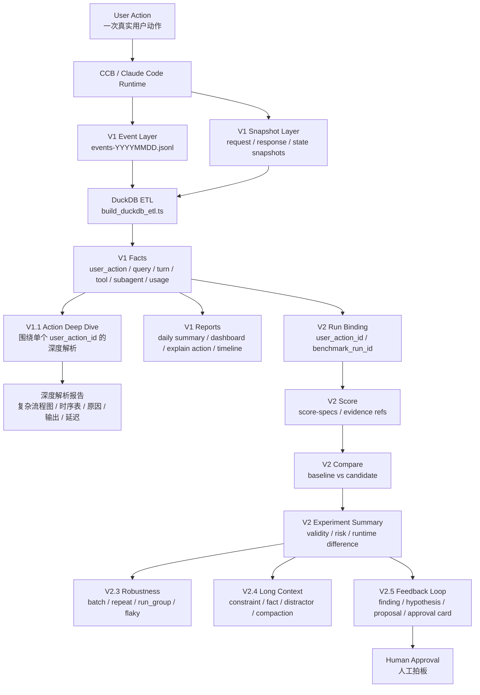

---

## 版本路线

| 阶段 | 一句话定位 | 解决的核心问题 | 主要产物 |
|---|---|---|---|
| **V1** | 本地事实观测系统 | 一次 user action 到底发生了什么？ | JSONL events、snapshots、DuckDB、action report、Mermaid DAG |
| **V1.1** | 单个 `user_action_id` 深度解析体系 | 如何把一次 action 拆到流程图、步骤原因、输出、延迟和证据？ | action 深度报告、复杂 Mermaid、时序表、主/子 agent 对照分析 |
| **V2.1** | `bind_existing` 评测入口 | 如何把已有 user_action_id 绑定成正式 run？ | run / score / compare / report |
| **V2.2-alpha** | `execute_harness` 自动执行 | 如何自动跑 scenario 并捕获 action？ | benchmark_run_id、自动 capture |
| **V2.2-beta / V2.2.5** | 真实实验闭环 | candidate 是否真的带来 runtime difference？ | real experiment summary、manual fallback |
| **V2.3** | Batch + Robustness | 多任务、多候选、多次重复是否稳定？ | run_group、stability summary、flaky status、batch report |
| **V2.4** | Long Context 专项 | 长上下文下是否保持约束、事实和治理效果？ | context.* score、long_context_summary、manual review notes |
| **V2.5** | Feedback Loop Beta | 实验结果如何变成下一步建议？ | finding、hypothesis、proposal queue、approval card |

> **V1.1 说明**：本项目里的 V1.1 对应 `ObservrityTask/10-系统版本/v1` 下围绕单个 `user_action_id` 的深度解析内容。它不是 V2 的 bridge，也不是独立评测系统，而是 V1 事实观测之上的“单 action 执行过程解剖台”。

---

## 为什么要做这套系统？

传统调试方式经常只能看到“模型最后说了什么”。但 Agent 系统真正复杂的地方不在最后一句话，而在中间过程：

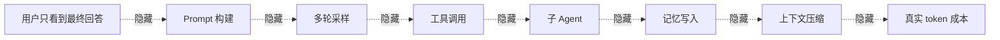

这套系统的核心价值是把这些“隐藏过程”变成证据：

- 哪个 subagent 被拉起？
- 为什么在这一刻拉起？
- tool call 是否完整闭合？
- prompt input 里 raw、cache read、cache create 各占多少？
- 成本是主线程造成的，还是记忆链路放大的？
- candidate 看起来更好，是偶然，还是多次 repeat 后仍然稳定？
- 真实长上下文任务里，系统有没有丢硬约束？
- 评测结果能不能沉淀成下一轮改动建议？

---

## 快速开始

### 环境要求

- **Bun**：建议使用最新版本
- **Node.js / Bun 兼容运行环境**
- **Windows + PowerShell**：当前观测脚本主要按 Windows PowerShell 工作流编写
- **DuckDB**：无需额外安装，仓库内已有本地可执行文件路径设计

安装依赖：

```bash
bun install
```

启动开发模式：

```bash
bun run dev
```

构建：

```bash
bun run build
```

类型检查：

```bash
bun run typecheck
```

---

## V1：本地可观测系统

V1 是整个系统的事实地基。它把运行时发生的事情写入本地：

```text
.observability/
├─ events-YYYYMMDD.jsonl
├─ snapshots/
│  ├─ request-*.json
│  ├─ response-*.json
│  └─ state-*.json
└─ observability_v1.duckdb
```

### V1 的核心对象

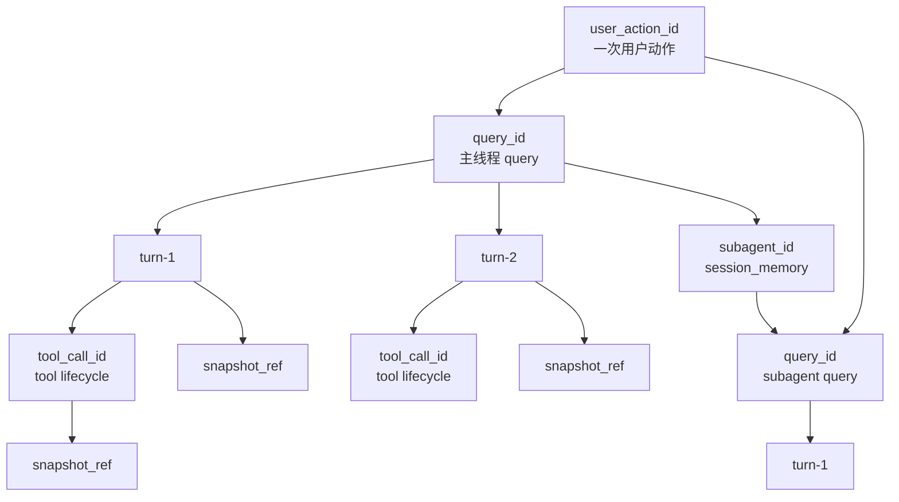

### V1 能看什么？

| 层级 | 可观测内容 | 典型问题 |
|---|---|---|
| Action | `user_action_id`、开始结束、总成本、总耗时 | 一次用户动作整体发生了什么？ |
| Query | 主线程 / 子线程 query、source、状态 | 这次动作分裂成了几条链？ |
| Turn | loop 次数、before/after snapshot、终态 | agent 绕了几轮？ |
| Tool | detected / enqueued / started / completed | 工具是否悬空或失败？ |
| Subagent | spawned / completed、reason、trigger kind | 为什么开了这个子 agent？ |
| Usage | raw input、cache read、cache create、output | token 真正花在哪里？ |
| Snapshot | request / response / state sidecar | 证据文件是否完整？ |

### V1 推荐运行流程

先真实运行一次程序，产生 `.observability/events-YYYYMMDD.jsonl`：

```bash
bun run dev
```

在 REPL 中发送至少一条真实 query 后，重建观测数据库：

```powershell
powershell -ExecutionPolicy Bypass -File .\scripts\observability\rebuild_observability_db.ps1
```

生成最近一次动作的解释报告：

```powershell
powershell -ExecutionPolicy Bypass -File .\scripts\observability\explain_action.ps1 -Latest
```

查看日级摘要：

```powershell
powershell -ExecutionPolicy Bypass -File .\scripts\observability\daily_summary.ps1
```

生成 dashboard：

```powershell
powershell -ExecutionPolicy Bypass -File .\scripts\observability\build_dashboard.ps1
```

查看单次 action 的时间线：

```powershell
powershell -ExecutionPolicy Bypass -File .\scripts\observability\read_timeline.ps1 -UserActionId <user_action_id>
```

### V1 报告长什么样？

一次 action 解释报告的结构大致是：

```text
Action Basics
├─ user_action_id
├─ started_at / duration
├─ query_count / turn_count / tool_count / subagent_count
├─ total_prompt_input_tokens
└─ total_billed_tokens

Query List
├─ repl_main_thread
├─ session_memory
└─ extract_memories

Branch Points
├─ post_sampling_hook / token_threshold_and_tool_threshold
├─ post_sampling_hook / token_threshold_and_natural_break
└─ stop_hook_background / post_turn_background_extraction

Mermaid DAG
└─ 可复制到 GitHub / Mermaid Live Editor 渲染
```

示例 DAG：

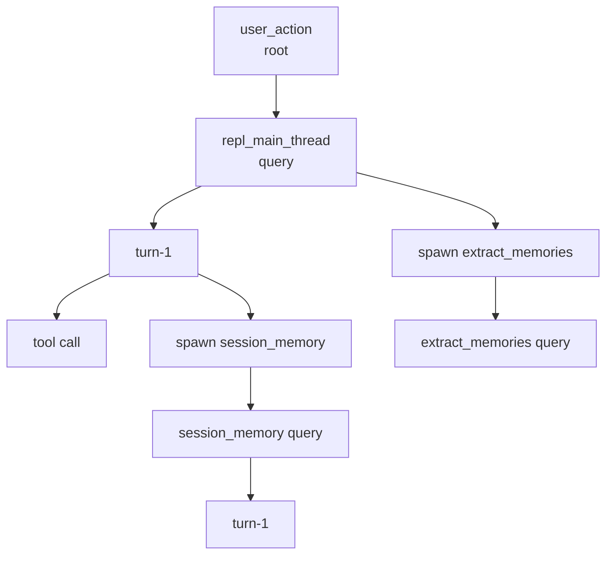

---

## V1.1：单个 user_action_id 深度解析

V1.1 是 V1 体系中的“深读层”。它不重新定义事件 Schema，也不另起一套评测系统，而是围绕一个已经存在的 `user_action_id` 做完整拆解。

它对应你本地的主要资料位置：

```text
E:\claude-code\ObservrityTask\10-系统版本\v1
```

仓库内对应资料位置：

```text
ObservrityTask/10-系统版本/v1/
```

V1 负责把事实采集齐；V1.1 负责把一个 action 讲清楚。

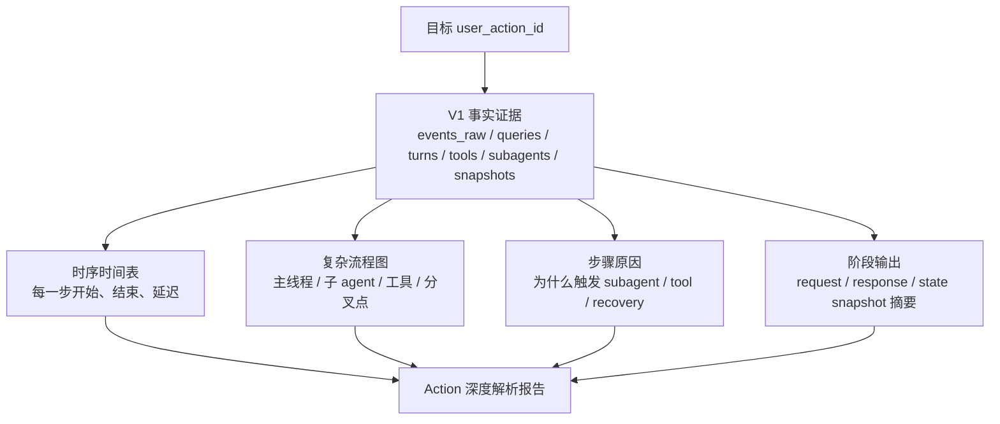

### V1.1 重点回答的问题

| 问题 | V1 提供事实 | V1.1 负责解释 |
|---|---|---|
| 这次 action 有几条链路？ | `queries` / `subagents` | 主线程与子 agent 的展开关系 |
| 每一步为什么发生？ | event type / trigger detail | 触发原因、上下文条件、分叉点解释 |
| 每一步大概输出了什么？ | snapshots / response refs | 阶段输出摘要与证据定位 |
| 每一步耗时多久？ | wall time / mono time / duration | 时序表、延迟瓶颈、等待段分析 |
| 工具调用如何影响流程？ | `tools` lifecycle | tool_use 前后状态变化与后续分支 |
| 子 agent 是否真的有价值？ | subagent usage / duration / output | 主线程与子链路成本、输出、延迟对照 |

### V1.1 和 V2 的区别

```text
V1   = 采集事实：这次运行发生了什么
V1.1 = 深读单个 action：这个 user_action_id 为什么这样展开
V2   = 做实验比较：baseline 和 candidate 哪个更值得继续
```

所以 V1.1 不应该被理解成 V2 的前身或 bridge，而应该被理解成：

> 面向一个真实 action 的“执行过程解剖台”。

它尤其适合这些任务：

- 给一个 `user_action_id` 画更复杂的 Mermaid 流程图
- 把主线程和子 agent 的每一步对齐到时序表
- 分析每个步骤的触发原因、阶段输出和大概延迟
- 对比本地 agent 与 GPT 网页端在执行过程上的差异
- 为后续 V2 experiment 提供人工理解基础

---

## V1 成本模型

不要只看 `input_tokens`。

V1 的成本模型按下面口径拆分：

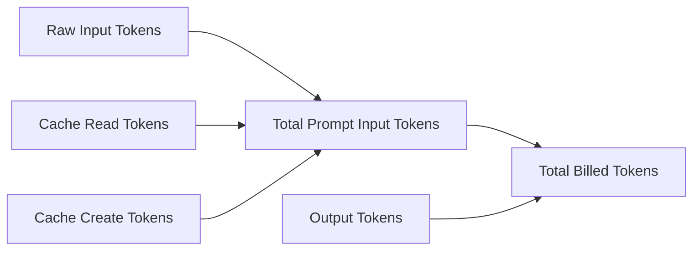

| 指标 | 含义 |
|---|---|
| `raw_input_tokens` | 本次请求真正新增的裸输入 |
| `cache_read_input_tokens` | 从缓存读取的上下文 |
| `cache_create_input_tokens` | 新建缓存所需的输入 |
| `total_prompt_input_tokens` | prompt 输入总量 |
| `output_tokens` | 模型输出 |
| `total_billed_tokens` | 估算总计费 token |
| `subagent_amplification_ratio` | 子链路成本相对主线程的放大倍数 |

这让你可以区分：用户输入本身太长、历史上下文太重、session memory 太贵、extract memories 放大成本，还是 candidate 只是少跑了一段链路。

---

## V2：本地评测系统

V2 不替代 V1，而是消费 V1 的事实证据。

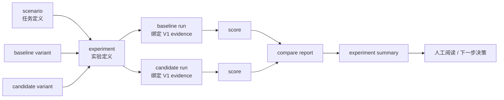

### V2 对象模型

| 对象 | 作用 | 目录 |
|---|---|---|
| `scenario` | 定义评测任务 | `tests/evals/v2/scenarios/` |
| `variant` | 定义 baseline / candidate 配置 | `tests/evals/v2/variants/` |
| `experiment` | 组合 scenario 与 variant | `tests/evals/v2/experiments/` |
| `run` | 一次 scenario + variant 的事实记录 | `tests/evals/v2/runs/` |
| `score` | run 上的评分结果 | `tests/evals/v2/scores/` |
| `run_group` | 多次 repeat 的聚合单元 | `tests/evals/v2/run-groups/` |
| `experiment summary` | 实验级 JSON 总结 | `tests/evals/v2/experiment-runs/` |
| `batch report` | 人类可读 Markdown 报告 | `ObservrityTask/10-系统版本/v2/06-运行报告/` |
| `feedback run` | V2.5 反馈闭环产物 | `tests/evals/v2/feedback/` |

---

## V2.2.5：真实实验闭环

V2.2.5 的价值是让系统同时具备两条可用路径：

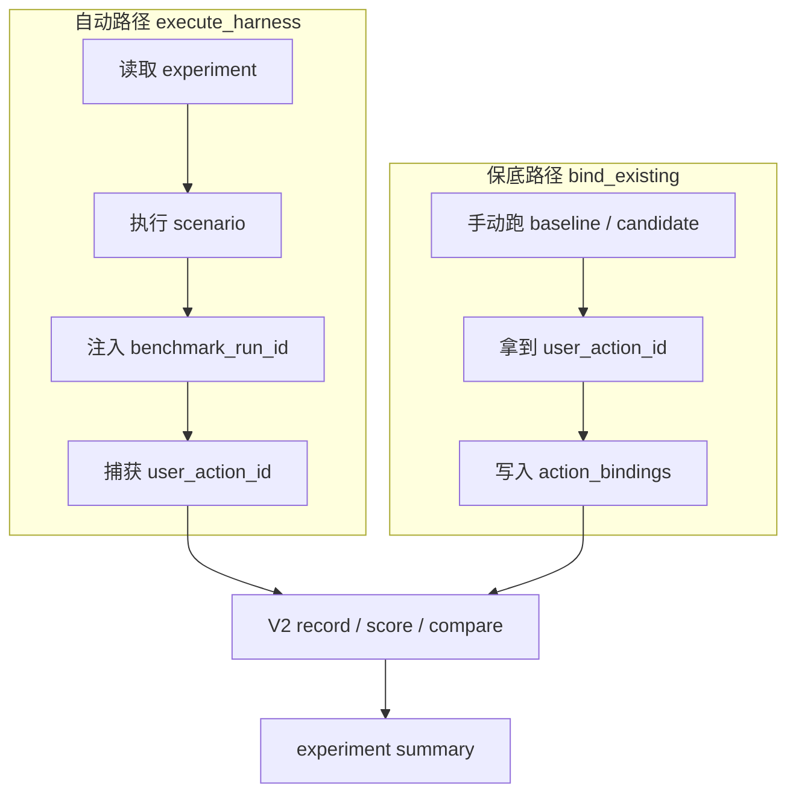

运行自动真实实验：

```powershell
bun run scripts/evals/v2_validate_manifests.ts
bun run scripts/evals/v2_run_experiment.ts --experiment tests/evals/v2/experiments/session_memory_runtime_sparse_vs_default.json
```

运行手动 fallback：

```powershell
.\scripts\evals\v2_manual_real_run.ps1 -ScenarioId "session_memory_trigger_sensitive" -VariantId "baseline_default" -ExperimentId "session_memory_runtime_sparse_vs_default_manual" -MaxTurns 12

.\scripts\evals\v2_manual_real_run.ps1 -ScenarioId "session_memory_trigger_sensitive" -VariantId "candidate_session_memory_sparse" -ExperimentId "session_memory_runtime_sparse_vs_default_manual" -MaxTurns 12

bun run scripts/evals/v2_run_experiment.ts --experiment tests/evals/v2/experiments/session_memory_runtime_sparse_vs_default_manual.bind_existing.json
```

---

## V2.3：Batch + Robustness

V2.3 解决的问题是：**一次实验结果是否稳定？**

它支持多 scenario、多 candidate、多次 repeat、run_group 聚合、stability summary、flaky status 和 batch markdown report。

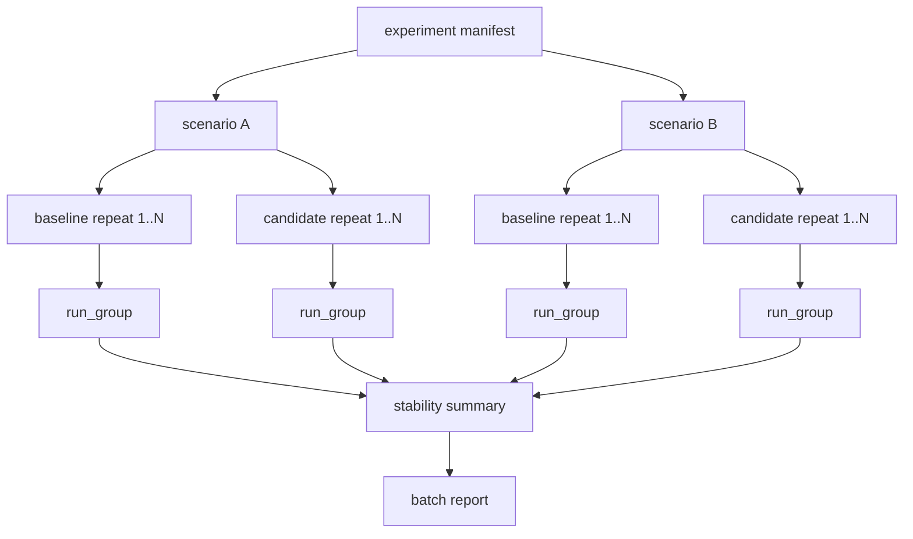

运行 V2.3 无成本 smoke：

```powershell
bun run scripts/evals/v2_run_experiment.ts --experiment tests/evals/v2/experiments/_experiment.robustness.smoke.json
```

重点看：`repeat_success_rate`、`capture_failure_rate`、`total_billed_tokens_stddev`、`tool_call_count_variance`、`subagent_count_variance`、`turn_count_variance`、`flaky_status`。

---

## V2.4：Long Context 专项

V2.4 让系统开始系统地问：上下文变长之后，这个 harness 到底有没有稳住约束、事实和治理效果？

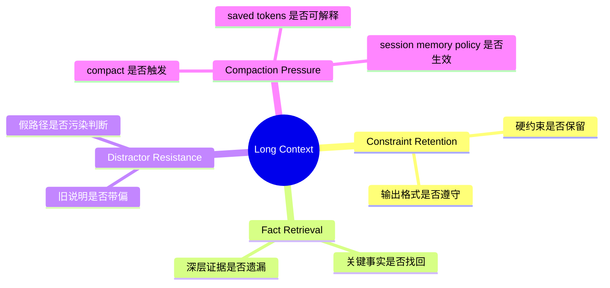

运行 fixture smoke：

```powershell
bun run scripts/evals/v2_run_experiment.ts --experiment tests/evals/v2/experiments/_experiment.long_context.fixture_smoke.json
```

运行小型真实链路 smoke：

```powershell
bun run scripts/evals/v2_run_experiment.ts --experiment tests/evals/v2/experiments/_experiment.long_context.real_smoke.json
```

验证长上下文 artifact：

```powershell
bun run scripts/evals/v2_verify_long_context.ts
```

---

## V2.5：Feedback Loop Beta

V2.5 的核心原则是：**自动提建议，不自动改代码。**

它不会自动合并 candidate，也不会绕过人工批准。它做的是把实验结果变成结构化的下一步建议。

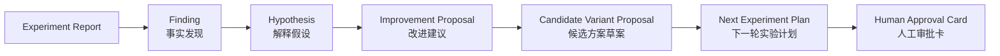

运行 feedback：

```powershell
bun run scripts/evals/v2_run_feedback.ts --experiment-run tests/evals/v2/experiment-runs/v2_4_long_context_real_smoke_2026-05-03T060617173Z.json
```

验证 feedback artifact：

```powershell
bun run scripts/evals/v2_validate_feedback_artifacts.ts
```

生成人工优先结论草稿：

```powershell
bun run scripts/evals/v2_create_manual_conclusion.ts --experiment-run tests/evals/v2/experiment-runs/v2_5_long_context_real_smoke_expectation_contract_v0_2026-05-03T153229792Z.json
```

---

## 常用命令总表

### 项目基础命令

```bash
bun install
bun run dev
bun run build
bun run typecheck
bun test
```

### V1 观测命令

```powershell
powershell -ExecutionPolicy Bypass -File .\scripts\observability\rebuild_observability_db.ps1
powershell -ExecutionPolicy Bypass -File .\scripts\observability\daily_summary.ps1
powershell -ExecutionPolicy Bypass -File .\scripts\observability\build_dashboard.ps1
powershell -ExecutionPolicy Bypass -File .\scripts\observability\explain_action.ps1 -Latest
powershell -ExecutionPolicy Bypass -File .\scripts\observability\explain_action.ps1 -UserActionId <user_action_id>
```

### V2 验证命令

```powershell
bun run scripts/evals/v2_validate_manifests.ts
bun run scripts/evals/v2_validate_experiment_artifacts.ts
bun run scripts/evals/v2_verify_bind_runner.ts
bun run scripts/evals/v2_verify_execute_harness_alpha.ts
bun run scripts/evals/v2_verify_long_context.ts
bun run scripts/evals/v2_validate_feedback_artifacts.ts
```

### V2 实验命令

```powershell
bun run scripts/evals/v2_run_experiment.ts --experiment tests/evals/v2/experiments/_experiment.execute_harness.smoke.json
bun run scripts/evals/v2_run_experiment.ts --experiment tests/evals/v2/experiments/session_memory_runtime_sparse_vs_default.json
bun run scripts/evals/v2_run_experiment.ts --experiment tests/evals/v2/experiments/_experiment.robustness.smoke.json
bun run scripts/evals/v2_run_experiment.ts --experiment tests/evals/v2/experiments/_experiment.long_context.fixture_smoke.json
bun run scripts/evals/v2_run_experiment.ts --experiment tests/evals/v2/experiments/_experiment.long_context.real_smoke.json
bun run scripts/evals/v2_run_experiment.ts --experiment tests/evals/v2/experiments/_experiment.long_context.real_smoke.expectation_contract_v0.json
```

---

## 目录地图

```text
.
├─ src/
│  └─ observability/
│     └─ v2/
│        ├─ evalTypes.ts
│        └─ evalExperimentTypes.ts
│
├─ scripts/
│  ├─ observability/
│  │  ├─ build_duckdb_etl.ts
│  │  ├─ rebuild_observability_db.ps1
│  │  ├─ daily_summary.ps1
│  │  ├─ build_dashboard.ps1
│  │  ├─ read_timeline.ps1
│  │  └─ explain_action.ps1
│  │
│  └─ evals/
│     ├─ v2_run_experiment.ts
│     ├─ v2_harness_execution.ts
│     ├─ v2_record_run.ts
│     ├─ v2_compare_runs.ts
│     ├─ v2_score_registry.ts
│     ├─ v2_run_feedback.ts
│     └─ v2_create_manual_conclusion.ts
│
├─ tests/
│  └─ evals/
│     └─ v2/
│        ├─ scenarios/
│        ├─ fixtures/
│        ├─ variants/
│        ├─ experiments/
│        ├─ score-specs/
│        ├─ runs/
│        ├─ scores/
│        ├─ run-groups/
│        ├─ experiment-runs/
│        └─ feedback/
│
├─ ObservrityTask/
│  ├─ README.md
│  └─ 10-系统版本/
│     ├─ v1/
│     │  ├─ 01-总览/
│     │  └─ 04-专题研究/
│     └─ v2/
│        ├─ 01-总览/
│        ├─ 02-实施任务书/
│        ├─ 06-运行报告/
│        └─ 07-反馈报告/
│
└─ .observability/
   ├─ events-YYYYMMDD.jsonl
   ├─ snapshots/
   └─ observability_v1.duckdb
```

---

## 典型工作流

### 工作流 A：调试一次真实用户动作

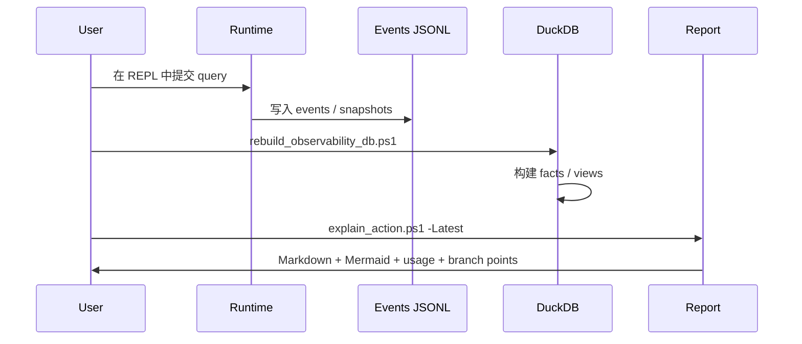

### 工作流 B：深度解析单个 user_action_id

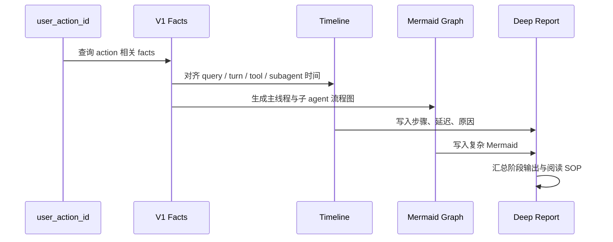

### 工作流 C：比较 baseline 与 candidate

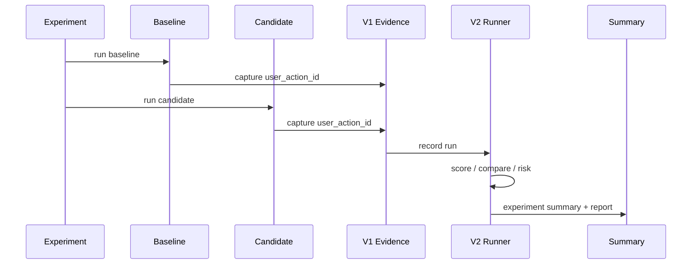

---

## 设计原则

### 1. 本地优先

所有核心事实都落在本地：JSONL、snapshot sidecar、DuckDB、Markdown report、experiment artifact。

### 2. 事实先于结论

```text
No evidence -> no score.
No binding -> no experiment.
No repeat -> no stability claim.
No manual review -> no semantic final verdict.
```

### 3. 深读单个 action，再谈系统改进

V1.1 的价值是先把一个真实 `user_action_id` 的执行过程讲清楚，再把理解沉淀到 V2 实验设计中。

### 4. 自动化不越权

V2.5 可以生成建议，但不自动改代码、不自动 promote candidate、不自动合并结论。人类仍然是最后审批者。

### 5. 不把单次成功误认为稳定规律

V2.3 之后，真正有价值的问题不再是“这一次好不好”，而是多次 repeat 后是否稳定。

---

## 当前边界

这套系统已经能做很多事情，但仍然有明确边界：

- 不是线上 APM 平台
- 不是分布式 trace 基础设施
- 不保证跨平台脚本都已完善
- 不自动证明 candidate 全局更优
- 不自动替代人工评审
- 不应该把 fixture smoke 当成真实模型收益结论
- 不应该把 feedback proposal 当成最终决策

---

## 适合谁使用？

- 想研究 Claude Code / CCB agent loop 的开发者
- 想知道一次 query 背后实际发生了什么的人
- 想调试 tool call、subagent、session memory、context compaction 的人
- 想围绕一个 `user_action_id` 做深度执行过程解析的人
- 想把 agent 改动做成可复盘实验的人
- 想用本地证据链比较 baseline / candidate 的人
- 想搭建“评测 -> 反馈 -> 下一轮实验”闭环的人

---

## FAQ

### Q: 我只是想看最近一次 query 发生了什么，应该从哪里开始？

运行：

```powershell
powershell -ExecutionPolicy Bypass -File .\scripts\observability\rebuild_observability_db.ps1
powershell -ExecutionPolicy Bypass -File .\scripts\observability\explain_action.ps1 -Latest
```

然后先读生成的 action report。

### Q: V1.1 到底是什么？

V1.1 是 `ObservrityTask/10-系统版本/v1` 里围绕单个 `user_action_id` 的深度解析内容。它重点不是新增采集字段，而是把一次 action 的流程、时序、原因、输出、延迟、主/子 agent 关系讲清楚。

### Q: V1、V1.1 和 V2 的区别是什么？

V1 是事实观测系统，回答“发生了什么”。  
V1.1 是单 action 深度解析，回答“这个 user_action_id 为什么这样展开”。  
V2 是评测系统，回答“baseline 和 candidate 的差异是否有证据支撑”。

### Q: 为什么不能只看 token 降低就说 candidate 更好？

因为 token 降低可能来自少跑链路、capture 失败、任务没完成、上下文丢失或语义质量下降。必须同时看 `experiment_validity`、`runtime_difference_summary`、`scorecard_summary`、`risk_verdict` 和必要的人工复核。

### Q: V2.5 会自动改代码吗？

不会。V2.5 当前是 feedback loop beta：自动生成建议，不自动改代码，不自动合并，不绕过人工审批。

---

## 来源说明

本项目来自原始 CCB 项目：

- Upstream: [https://github.com/claude-code-best/claude-code](https://github.com/claude-code-best/claude-code)

当前仓库在此基础上加入并整理了本地可观测、单 action 深度解析、V2 评测、长上下文专项与反馈闭环相关内容。

---

## License / 声明

本项目仅供学习、研究与工程实验使用。  
原始 Claude Code 相关权利归其各自权利方所有。  
CCB 原始项目来源见：[claude-code-best/claude-code](https://github.com/claude-code-best/claude-code)。
